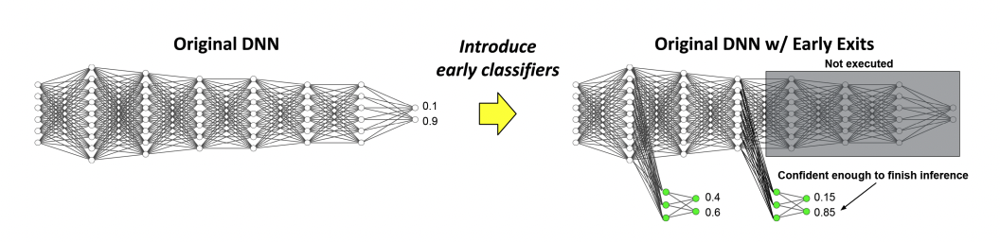

# Early-Exit-Models
 This repository is dedicated to self-learning about early exit models, including relevant code and documentation.  

| Survey Papers    | code              | Comments    |
|-------------|-------------------------|-------------|
| 1. [Split Computing and Early Exiting for Deep Learning Applications: Survey and Research Challenges](https://dl.acm.org/doi/pdf/10.1145/3527155) |       | Fundamental Survey Paper Section 4|
| 3. [Distributed Artificial Intelligence Empowered by End-Edge-Cloud Computing: A Survey](https://ieeexplore.ieee.org/stamp/stamp.jsp?tp=&arnumber=9933792)||Section III-C-4|
| 2. [End-Edge-Cloud Collaborative Computing for Deep Learning: A Comprehensive Survey](https://ieeexplore.ieee.org/stamp/stamp.jsp?tp=&arnumber=10508191)|  | Section III-B|
| 3. |  | |
| 3. |  | |
| 3. |  | |

| Papers   | code               | Comments   |
|-------------|-------------------------|-------------|
| 1. [BranchyNet: Fast Inference via Early Exiting from Deep Neural Networks](https://arxiv.org/abs/1709.01686)| [Official Code](https://gitlab.com/kunglab/branchynet) [code](https://github.com/gorakraj/earlyexit_onnx/tree/master/Networks/6.%20BranchyNet)      | Fundamental  Paper |
| 3.[Distributed Deep Neural Networks over the Cloud, the Edge and End Devices](https://ieeexplore.ieee.org/stamp/stamp.jsp?tp=&arnumber=7979979) | [Offical Code](https://github.com/kunglab/ddnn) | Follow up work, node-edge-cloud setting|
| 2.[Branchy-GNN: a Device-Edge Co-Inference Framework for Efficient Point Cloud Processing](https://arxiv.org/abs/2011.02422) | [Offical Code](https://github.com/shaojiawei07/Branchy-GNN) | GNN|
| 3.[EdgeKE: An On-Demand Deep Learning IoT System for Cognitive Big Data on Industrial Edge Devices](https://ieeexplore.ieee.org/stamp/stamp.jsp?tp=&arnumber=9294146) | [Offical Code](https://github.com/fangvv/EdgeKE) | knowledge distillation, early exit to meet latency or accuracy requirements|
| 3.[A lightweight collaborative deep neural network for the mobile web in edge cloud](https://ieeexplore.ieee.org/stamp/stamp.jsp?tp=&arnumber=9286558) |  | Binary neural network branch |
| 3.[A Lightweight Collaborative Recognition System with Binary Convolutional Neural Network for Mobile Web Augmented Reality](https://ieeexplore.ieee.org/stamp/stamp.jsp?tp=&arnumber=8884895) |  | Binary neural network branch |
| 3.[Edge Intelligence: On-Demand Deep Learning Model Co-Inference with Device-Edge Synergy (Edgent)](https://arxiv.org/pdf/1806.07840) |  | partitions DNN computation between mobile and edge server based on the available bandwidth|
| 3.[DeepAdapter: A Collaborative Deep Learning Framework for the Mobile Web Using Context-Aware Network Pruning](https://ieeexplore.ieee.org/stamp/stamp.jsp?tp=&arnumber=9155379) |  | Follow up work of Edgent, online inference|
| 3.[Cloudedge-based lightweight temporal convolutional networks for remaining useful life prediction in IIoT](https://ieeexplore.ieee.org/stamp/stamp.jsp?tp=&arnumber=9137209) |  | two scale prediction |
| 3. |  | |
| 3. |  | |

# Early-Exit-Models in Federated Settings

| Papers   | code               | Comments    |
|-------------|-------------------------|-------------|
| 1. [Federated Learning for Cooperative Inference Systems: The Case of Early Exit Networks](https://arxiv.org/abs/2405.04249) |       | Cooperative Inference Systems settings |
| 3. |  | |
| 3. |  | |
| 3. |  | |
| 3. |  | |
| 3. |  | |
| 3. |  | |

# AI on Edge
| Papers   | code               | Comments    |
|-------------|-------------------------|-------------|
| Enabling AI on Edges: Techniques, Applications and Challenges | [Offical Code](https://github.com/wangxb96/Awesome-AI-on-the-Edge) | |

**Early Exit inference model from Fig.7 in Split Computing and Early Exiting for Deep Learning Applications: Survey and Research Challenges, YOSHITOMO MATSUBARA and MARCO LEVORATO, University of California, Irvine, USA, FRANCESCO RESTUCCIA, Northeastern University, USA**
